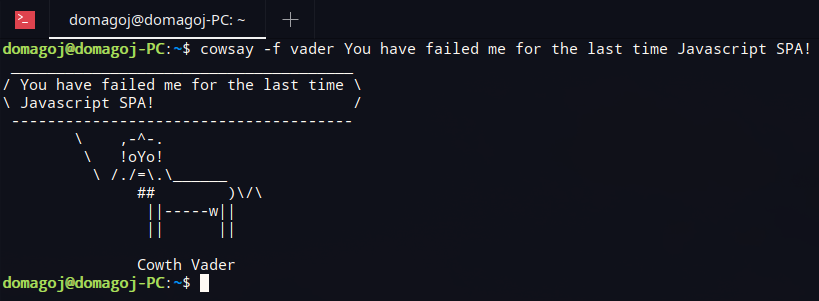

# SpringShell CLI Demo

[](https://www.gnu.org/licenses/gpl-3.0)


Sample Command line interpreter (CLI) demo app developed with Spring Shell library.



## How to use this repository?

Master branch contains current/final state of the the CLI demo, while particular branches,
for example **part1** contain code relevant for specific part of the tutorial (ie. Part 1).

Happy coding!
### Setup (First time)
1. Clone the repository: `git clone git@github.com:dmadunic/clidemo.git`
2. Build project with: `./gradlew clean build `

Now you can run it by executing the following command:

```bash
./run-cli.sh
```

## Release new version
Make sure that file gradle.properties in the folder ${USER_HOME}/.gradle/ contains the following two variables defined:

* github_username
* github_password : personal github token to be used to install/update packages

1) Commit and push everything
2) `./gradlew release`

And simply follow the instructions on the console

## Changelog

### Contributors
- Domagoj Madunić


(c) AG04 Innovative Solutions d.o.o. (2022)

